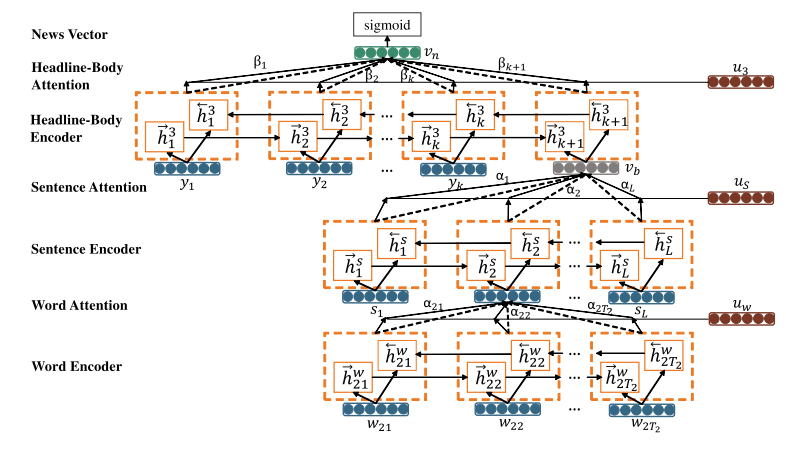

# 3HAN: A Deep Neural Network for Fake News Detection

This repository contains code in Keras for the models, baselines and visualizations used in the paper [3HAN: A Deep Neural Network for Fake News Detection](https://link.springer.com/chapter/10.1007%2F978-3-319-70096-0_59).

 

## Abstract
The proliferation of fake news has possibly led to a mis-informed public opinion. We propose 3HAN, a three level hierarchical attention network, which creates a news vector, a representation of news articles to detect fake news. Our model (i) interprets the structure of an article as a three level hierarchy of words, sentences and headline, (ii) treats the headline as a distinctive feature and (iii) uses attention to differentiate elements of an hierarchy consistent with their interactions when constructing the news vector. Experiments on our large real world data set demonstrate the effectiveness of news vector in giving state-of- the-art performance. Visualizing the attention layers provides important parts of an article which is helpful in further human fact-checking.

## Models
The models folder contains code for:
* 3HAN-Ave: Vectors are composed using global average pooling
* 3HAN-Max: Vectors are composed using global max pooling
* 3HAN: Our proposed model with attention mechanism
* 3HAN+PT: Variant of 3HAN to include pre-training

## Baselines
The baselines folder contains code for:

* Word Count Based Models:

    * Majority uses the heuristic of taking the majority label in the training set as the assigning label to every point in the test set.
    * Bag-of-words and its TF-IDF constructs a vocabulary of the most frequent 50,000 words. The count of these words is used as features. The TF-IDF count is used as features in the other model variant.
    * Bag-of-ngrams and its TF-IDF uses the count of the 50,000 most frequent ngrams (n <= 5). The features are formed in the same way as above.
    * SVM+Bigrams uses the count of the 50,000 most frequent bigrams as features with an SVM classifier.

* Neural Network Models: 

    * GloVe-Avg flattens the article text to a word level granularity as a sequence of words. The GloVe embeddings of all words are averaged to form the feature vector. 
    * GRU treats the article text as a sequence of words. A GRU with an annotation dimension of 300 is run on the sequence of GloVe word embeddings. The hidden annotation after the last time step is used as the feature vector. 
    * GRU-Avg runs a GRU on the sequence of word embeddings and returns all hidden annotations at each time step. The average of these hidden annotations is used as the feature vector. 
    * HAN and Variants include HAN-Ave, Han-Max and HAN. HAN uses a two level hierarchical attention network. HAN-Ave and Han-Max replaces the attention mechanism with average and max pooling for composition respectively. Since the code is not officially released we use our own implementation.

## Requirements 

* Keras 2.0.4 
* Theano 0.9.0 
* Python 3.4.3

## Reference

Singhania S., Fernandez N., Rao S. (2017) 3HAN: A Deep Neural Network for Fake News Detection. In: Liu D., Xie S., Li Y., Zhao D., El-Alfy ES. (eds) Neural Information Processing. ICONIP 2017. Lecture Notes in Computer Science, vol 10635. Springer, Cham

## 
